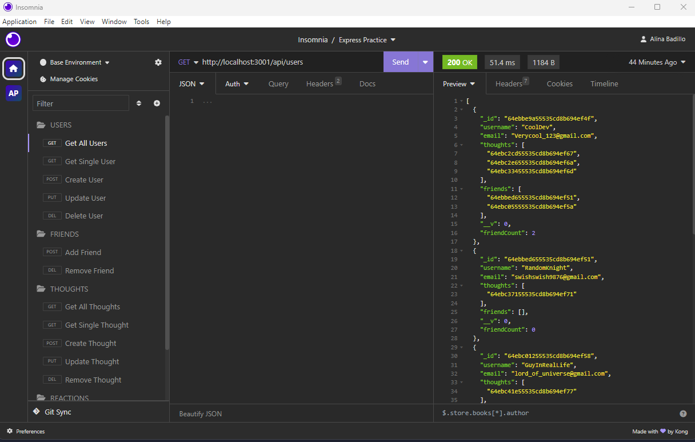

# NoSQL Social Network API

[](https://opensource.org/licenses/MIT)


## Description
This Social Network API is great for handling large amounts of unstructured data, because it uses NoSQL database (MongoDB).

You can share your thoughts, react to other people thoughts' and add users to your friendlist. 

## Table of Contents
- [Demo](#demo)
- [Installation](#installation)
- [Usage](#usage)
- [Contributing](#contributing)
- [Credits](#credits)
- [License](#license)
- [Questions](#questions)

## Demo
A video demonstration of the API using Insomnia: [Demo](https://watch.screencastify.com/v/AVwssqPmJCKKYLonoTMt)

## Installation
Clone the repository.
```
git clone git@github.com:AlinaB108/social-network-api.git
```
Create package.json:
```
npm init -y
```
Install all dependencies from package.json:
```
npm i
```
The app uses dotenv
```
npm i dotenv 
```
You will also need express.js
```
npm i express
```
And mongoose
```
npm i mongoose
```

## Usage
Start the server
```
node server.js
```
Make sure you have MongoDB. To see if our API routes are working you will need either Insomnia or Postman.



## Contributing
1. Fork the project by clicking Fork in the top-right corner of the page.
2. Clone the repository.
3. Create a new branch to work on.
4. Commit the changes.
5. Push to the branch.
6. Create a pull request.

## License
[](https://opensource.org/licenses/MIT)

https://opensource.org/licenses/MIT 
    
## Questions
If you have any questions, send me a message [GitHub](https://github.com/AlinaB108) or send me an email: [alinachristabel108@gmail.com](alinachristabel108@gmail.com)
